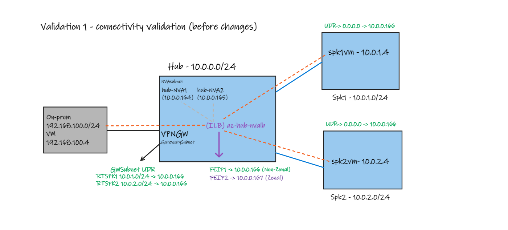
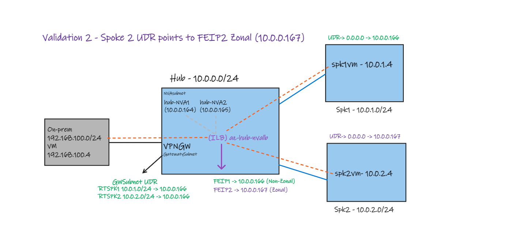
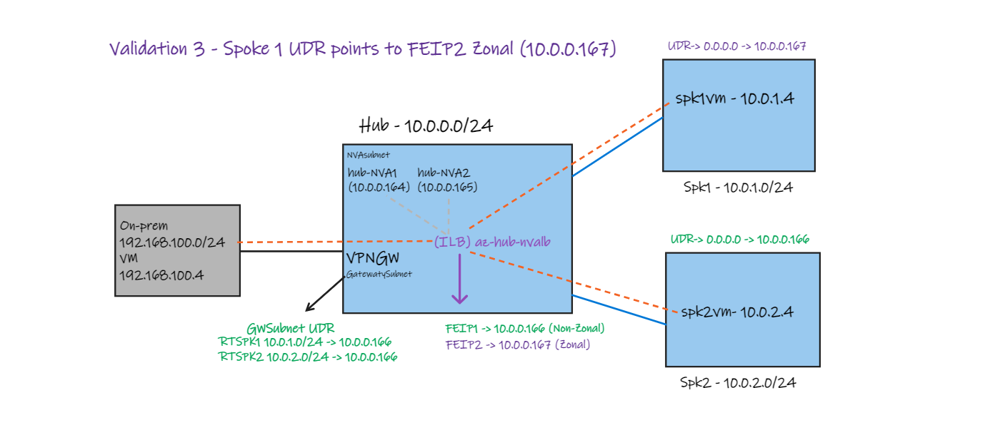

# Azure Load Balancer Frontend IP migration (Non-Zonal to Zonal)

**DISCLAIMER:** At this moment. This is a proof of concept only and should not be used as final guidance.

**Content**

- [Intro](#intro)
- [Network Diagram](#network-diagram)
- [Deploy this solution](#deploy-this-solution)
- [Validation 1](#validation-1)
- [Validation 2](#validation-2)
- [Validation 3](#validation-3)
- [Clean up](#clean-up)

### Intro

This is an proof of concept to validate a non-Zonal frontend IP coexisting with a Zonal over a single Internal Load Balancer.
See details of Load Balancer config used on the diagram below.

### Network Diagram


### Components

- All VM's are accessible using SSH (restricted by your Home Public IP) Bastion or Serial Console.
- Default username is _azureuser_ and password _Msft123Msft123_.

**Azure side:**
 - Azure Hub (10.0.0.0/24) and two Spokes (Spoke1 - 10.0.1.0/24 and Spoke 2 - 10.0.2.0/24).
 - Each spoke as a Linux VM (az-spk1-lxvm and az-spk1-lxvm).
 - Two Linux NVAs (10.0.0.164, 10.0.0.165) with IPtables.
 - Internal Load Balancer with two Frontend IPs: first non-zonal (10.0.0.166) and second zonal (10.0.0.166).
   - Two load balancer rules to each front end IP with HA ports using both Linux NVAs as backends.

**On-premises side:**
 - On-prem VNET (192.168.100.0/24) using VPN Gateway with S2S VPN to Azure.
 - Linux VM onprem-lxvm.


### Deploy this solution
The lab is also available in the above .azcli that you can rename as .sh (shell script) and execute. You can open [Azure Cloud Shell (Bash)](https://shell.azure.com) or Azure CLI via Linux (Ubuntu) and run the following commands to build the entire lab:

```Bash
wget -O migrate-lb-deploy.sh https://raw.githubusercontent.com/dmauser/azure-loadbalancer/main/migrate-azlb/migrate-lb-deploy.azcli
chmod +xr migrate-lb-deploy.sh
./migrate-lb-deploy.sh
```

**Note:** the provisioning process will take 60-90 minutes to complete. Also, note that Azure Cloud Shell has a 20 minutes timeout and make sure you watch the process to make sure it will not timeout causing the deployment to stop. You can hit enter during the process just to make sure Serial Console will not timeout. Otherwise, you can install it using any Linux. In can you have Windows OS you can get a Ubuntu + WSL2 and install Azure CLI.

## Validation 1



```Bash
#Parameters
rg=lab-lb-migrate #Define your resource group
location=(az group show -n $rg --query location -o tsv)#Set location

#Define parameters for Azure Hub and Spokes:
AzurehubName=az-hub #Azure Hub Name
AzurehubNamesubnetName=subnet1 #Azure Hub Subnet name where VM will be provisioned
Azurehubsubnet1Prefix=10.0.0.0/27 #Azure Hub Subnet address prefix
Azurespoke1Name=az-spk1 #Azure Spoke 1 name
Azurespoke2Name=az-spk2 #Azure Spoke 1 name
#Variables
nva1ip=$(az network nic show -g $rg --name $AzurehubName-lxnva1-nic --query "ipConfigurations[].privateIpAddress" -o tsv)
nva2ip=$(az network nic show -g $rg --name $AzurehubName-lxnva2-nic  --query "ipConfigurations[].privateIpAddress" -o tsv)
# Frontendip1 (non-zonal)
nvalbip1=$(az network lb show -g $rg --name $AzurehubName-nvalb --query "frontendIpConfigurations[0].privateIpAddress" -o tsv)
# Frontendip2 (zonal)
nvalbip2=$(az network lb show -g $rg --name $AzurehubName-nvalb --query "frontendIpConfigurations[1].privateIpAddress" -o tsv)


# 1) Connectivity tests before UDR change:

# Review the Linux NVAs have IPTables enforced
# Via Bastion or Serial console run:
sudo iptables -L -v -n --line-numbers

#Example/Expected output for FORWARD rules:
# {Chain FORWARD (policy ACCEPT 0 packets, 0 bytes)
#num   pkts bytes target     prot opt in     out     source               destination         
#1      157  8680 ACCEPT     all  --  *      *       0.0.0.0/0            0.0.0.0/0            ctstate RELATED,ESTABLISHED
#2       60  2480 ACCEPT     tcp  --  eth0   *       0.0.0.0/0            0.0.0.0/0            tcp dpt:80
#3        0     0 ACCEPT     tcp  --  eth0   *       0.0.0.0/0            0.0.0.0/0            tcp dpt:443
#4        0     0 ACCEPT     tcp  --  eth0   *       0.0.0.0/0            0.0.0.0/0            tcp dpt:53
#5        0     0 ACCEPT     tcp  --  eth0   *       0.0.0.0/0            0.0.0.0/0            tcp dpt:22
#6        0     0 ACCEPT     tcp  --  eth0   *       0.0.0.0/0            0.0.0.0/0            tcp dpt:5201
#7        1    84 ACCEPT     icmp --  eth0   *       0.0.0.0/0            0.0.0.0/0            icmptype 8
#8        0     0 ACCEPT     icmp --  eth0   *       0.0.0.0/0            0.0.0.0/0            icmptype 0
#9        0     0 DROP       all  --  *      *       0.0.0.0/0            0.0.0.0/0  

# Access Bastion or Serial console on az-SPK1-lxvm:
# Run the following
ping 10.0.2.4 -c 5
sudo hping3 10.0.2.4 -S -p 80 -c 10
curl 10.0.2.4

# Access Bastion or Serial console on az-SPK2-lxvm:
# Run the following
ping 10.0.1.4 -c 5
sudo hping3 10.0.1.4 -S -p 80 -c 10
curl 10.0.1.4

# Optional - you can run commands fron onprem-vmlx
# Optional - You can also remove NVA Linux icmp rule to ensure IPtables is being enforced
# Note: That will make ping to stop working on the following tests
sudo iptables -L -v -n --line-numbers

#Example:
# {Chain FORWARD (policy ACCEPT 0 packets, 0 bytes)
#num   pkts bytes target     prot opt in     out     source               destination         
#1      157  8680 ACCEPT     all  --  *      *       0.0.0.0/0            0.0.0.0/0            ctstate RELATED,ESTABLISHED
#2       60  2480 ACCEPT     tcp  --  eth0   *       0.0.0.0/0            0.0.0.0/0            tcp dpt:80
#3        0     0 ACCEPT     tcp  --  eth0   *       0.0.0.0/0            0.0.0.0/0            tcp dpt:443
#4        0     0 ACCEPT     tcp  --  eth0   *       0.0.0.0/0            0.0.0.0/0            tcp dpt:53
#5        0     0 ACCEPT     tcp  --  eth0   *       0.0.0.0/0            0.0.0.0/0            tcp dpt:22
#6        0     0 ACCEPT     tcp  --  eth0   *       0.0.0.0/0            0.0.0.0/0            tcp dpt:5201
#7        1    84 ACCEPT     icmp --  eth0   *       0.0.0.0/0            0.0.0.0/0            icmptype 8
#8        0     0 ACCEPT     icmp --  eth0   *       0.0.0.0/0            0.0.0.0/0            icmptype 0
#9        0     0 DROP       all  --  *      *       0.0.0.0/0            0.0.0.0/0  
sudo iptables -D FORWARD 7 # Run once
sudo iptables -D FORWARD 7 # Run twice
sudo iptables -L -v -n --line-numbers
# Icmp lines should be removed.
# ====> Remember to run on both NVAs.
```
### Validation 2



```Bash
# 2) UDR Change on Spoke 2 to point to Zonal LBFE (Spoke 1 points to non-zonal LBFE)

## Dump non-zonal and Zonal LB Frontends

echo 'Frontendip1 (non-zonal)' &&\
az network lb show -g $rg --name $AzurehubName-nvalb --query "frontendIpConfigurations[0].privateIpAddress" -o tsv &&\
echo 'Frontendip2 (zonal)' &&\
az network lb show -g $rg --name $AzurehubName-nvalb --query "frontendIpConfigurations[1].privateIpAddress" -o tsv

## Updating UDRs -> SPK1 default route to Frontendip1 and SPK2 VM route to Frontendip2
# RT-Spoke1-to-nvalb
az network route-table route update --resource-group $rg --name Default-to-nvalb --route-table-name RT-Spoke1-to-nvalb \
 --address-prefix 0.0.0.0/0 \
 --next-hop-type VirtualAppliance \
 --next-hop-ip-address $nvalbip1 \
 --output none
az network route-table route create --resource-group $rg --name Hub-to-nvalb --route-table-name RT-Spoke1-to-nvalb   \
 --address-prefix $Azurehubsubnet1Prefix \
 --next-hop-type VirtualAppliance \
 --next-hop-ip-address $nvalbip1 \
 --output none
# RT-Spoke2-to-nvalb  
az network route-table route update --resource-group $rg --name Default-to-nvalb --route-table-name RT-Spoke2-to-nvalb \
 --address-prefix 0.0.0.0/0 \
 --next-hop-type VirtualAppliance \
 --next-hop-ip-address $nvalbip2 \
 --output none
az network route-table route create --resource-group $rg --name Hub-to-nvalb --route-table-name RT-Spoke2-to-nvalb   \
 --address-prefix $Azurehubsubnet1Prefix \
 --next-hop-type VirtualAppliance \
 --next-hop-ip-address $nvalbip2 \
 --output none

#Check source/destination VMs effective routes
echo $Azurespoke1Name-lxvm &&\
az network nic show --resource-group $rg -n $Azurespoke1Name-lxvm-nic --query "ipConfigurations[].privateIpAddress" -o tsv &&\
az network nic show-effective-route-table --resource-group $rg -n $Azurespoke1Name-lxvm-nic -o table
echo $Azurespoke2Name-lxvm &&\
az network nic show --resource-group $rg -n $Azurespoke2Name-lxvm-nic --query "ipConfigurations[].privateIpAddress" -o tsv &&\
az network nic show-effective-route-table --resource-group $rg -n $Azurespoke2Name-lxvm-nic -o table

### Test/Actions
# (Optional)Capture Network Trace on both NVAs
sudo tcpdump -n host 10.0.1.4 and host 10.0.2.4 -w nva1test1.pcap
sudo tcpdump -n host 10.0.1.4 and host 10.0.2.4 -w nva2test1.pcap

Access Bastion or Serial console on 
# Access Bastion or Serial console on az-SPK1-lxvm:
# Run the following
ping 10.0.2.4 -c 5
sudo hping3 10.0.2.4 -S -p 80 -c 10
curl 10.0.2.4

# Access Bastion or Serial console on az-SPK2-lxvm:
# Run the following
ping 10.0.1.4 -c 5
sudo hping3 10.0.1.4 -S -p 80 -c 10
curl 10.0.1.4

# Access Bastion or Serial console on onprem-lxvm:
# Run the following against az-SPK2-lxvm that got the UDR change to the Zonal LBFE.
ping 10.0.2.4 -c 5
sudo hping3 10.0.2.4 -S -p 80 -c 10
curl 10.0.2.4

```

### Validation 3



```Bash

# 3) UDR Change on Spoke 1 to point to Zonal LB (Spoke 2 points to non-zonal LBFE)

## Dump non-zonal and Zonal LB Frontends

echo 'Frontendip1 (non-zonal)' &&\
az network lb show -g $rg --name $AzurehubName-nvalb --query "frontendIpConfigurations[0].privateIpAddress" -o tsv &&\
echo 'Frontendip2 (zonal)' &&\
az network lb show -g $rg --name $AzurehubName-nvalb --query "frontendIpConfigurations[1].privateIpAddress" -o tsv

## Updating UDRs -> SPK1 default route to Frontendip1 and SPK2 VM route to Frontendip2
# RT-Spoke1-to-nvalb
az network route-table route update --resource-group $rg --name Default-to-nvalb --route-table-name RT-Spoke1-to-nvalb \
 --address-prefix 0.0.0.0/0 \
 --next-hop-type VirtualAppliance \
 --next-hop-ip-address $nvalbip2 \
 --output none
az network route-table route create --resource-group $rg --name Hub-to-nvalb --route-table-name RT-Spoke1-to-nvalb   \
 --address-prefix $Azurehubsubnet1Prefix \
 --next-hop-type VirtualAppliance \
 --next-hop-ip-address $nvalbip2 \
 --output none
# RT-Spoke2-to-nvalb  
az network route-table route update --resource-group $rg --name Default-to-nvalb --route-table-name RT-Spoke2-to-nvalb \
 --address-prefix 0.0.0.0/0 \
 --next-hop-type VirtualAppliance \
 --next-hop-ip-address $nvalbip1 \
 --output none
az network route-table route create --resource-group $rg --name Hub-to-nvalb --route-table-name RT-Spoke2-to-nvalb   \
 --address-prefix $Azurehubsubnet1Prefix \
 --next-hop-type VirtualAppliance \
 --next-hop-ip-address $nvalbip1 \
 --output none

#Check source/destination VMs effective routes
echo $Azurespoke1Name-lxvm &&\
az network nic show --resource-group $rg -n $Azurespoke1Name-lxvm-nic --query "ipConfigurations[].privateIpAddress" -o tsv &&\
az network nic show-effective-route-table --resource-group $rg -n $Azurespoke1Name-lxvm-nic -o table
echo $Azurespoke2Name-lxvm &&\
az network nic show --resource-group $rg -n $Azurespoke2Name-lxvm-nic --query "ipConfigurations[].privateIpAddress" -o tsv &&\
az network nic show-effective-route-table --resource-group $rg -n $Azurespoke2Name-lxvm-nic -o table

### Test/Actions
# (Optional)Capture Network Trace on both NVAs
sudo tcpdump -n host 10.0.1.4 and host 10.0.2.4 -w nva1test1.pcap
sudo tcpdump -n host 10.0.1.4 and host 10.0.2.4 -w nva2test1.pcap

Access Bastion or Serial console on 
# Access Bastion or Serial console on az-SPK1-lxvm:
# Run the following
ping 10.0.2.4 -c 5
sudo hping3 10.0.2.4 -S -p 80 -c 10
curl 10.0.2.4

# Access Bastion or Serial console on az-SPK2-lxvm:
# Run the following
ping 10.0.1.4 -c 5
sudo hping3 10.0.1.4 -S -p 80 -c 10
curl 10.0.1.4

# Access Bastion or Serial console on onprem-lxvm:
# Run the following against az-SPK2-lxvm that got the UDR change to the Zonal LBFE.
ping 10.0.2.4 -c 5
sudo hping3 10.0.2.4 -S -p 80 -c 10
curl 10.0.2.4
```

### Clean-up

```bash
# Parameters 
rg=lab-lb-migrate  #set resource group

### Clean up
az group delete -g $rg --no-wait 
```